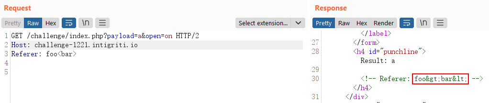
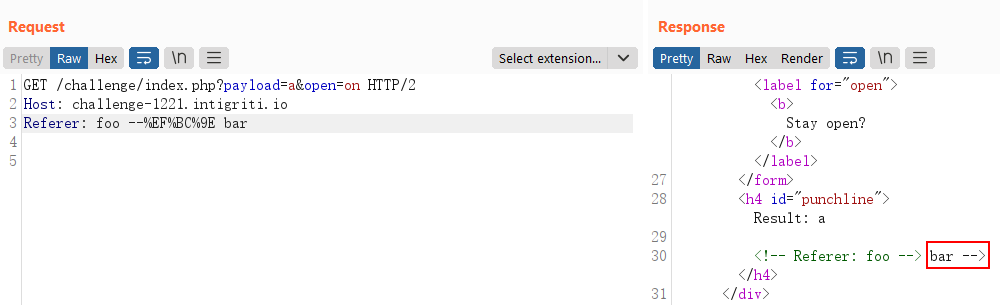
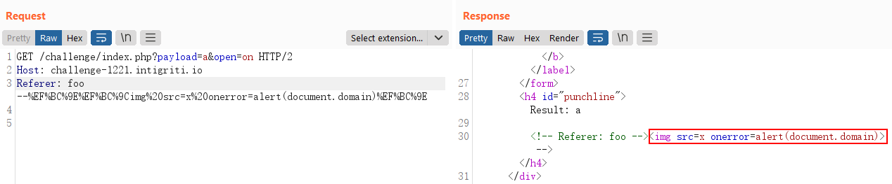
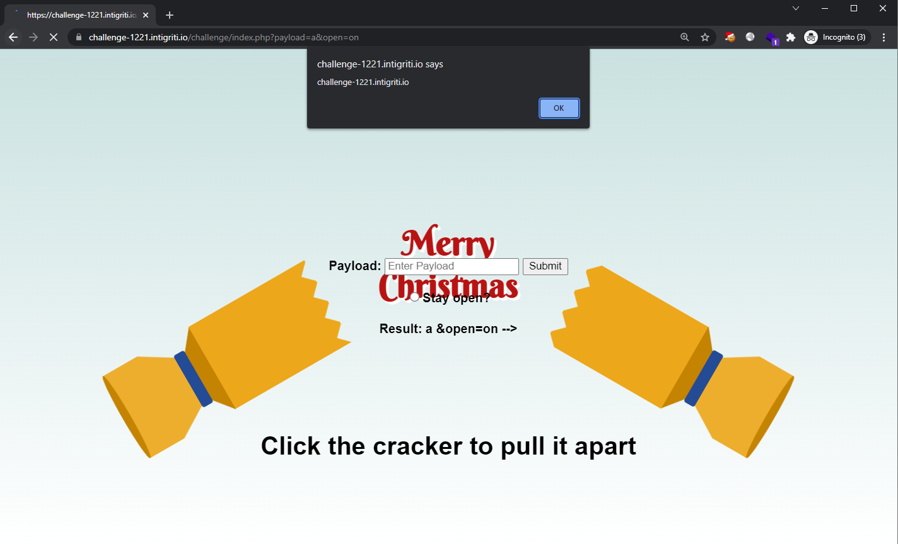

## Write-up

This month's challenge is quite straight-forward and it only ran for a few days. Merry Christmas to those that celebrate it! 🎅

---

Examining the source code of the page, we see that the contents of the `Referer` request header is reflected in the page as well, wrapped between a HTML comment:

```html
<form action="index.php" method="get">
    <label for="payload"><b>Payload:</b></label>
    <input type="text" placeholder="Enter Payload" name="payload">
    <button type="submit">Submit</button>
    <br>
    <br>
    <input type="radio" name="open"><label for="open"><b>Stay open?</b></label>
</form>
<h4 id="punchline">Result: a

<!-- Referer: https://challenge-1221.intigriti.io/challenge/index.php?payload=a&open=on --></h4>
```

This HTML comment only appears if the `payload` parameter is defined. So now we see that there are 2 ways user input is reflected in the response:
1. `payload` HTTP GET parameter
2. `Referer` HTTP request header

After tampering with the application abit, I concluded that the `payload` HTTP parameter is very restrictive and is likely a rabbit hole as the `<` character will be stripped.

So I looked at how `Referer` is handled before its value is reflected in the response body.



It looks like the angle brackets are encoded in the response. These angle brackets that are found in the standard ASCII set are actually the [half-width](https://en.wikipedia.org/wiki/Halfwidth_and_fullwidth_forms) versions; there are **full-width** versions of these characters.

So what happens when we try to send the full-width versions of the angle brackets?



The payload above translates to `--＞ bar` where `＞` is the full-width version of `>`. Notice that we have managed to escape out of the HTML comment block and `bar` is now in the raw HTML output.

We can now prepare our XSS payload:

```
--＞＜img src=x onerror=alert(document.domain)＞
```

which when encoded, looks like:

```
--%EF%BC%9E%EF%BC%9Cimg%20src=x%20onerror=alert(document.domain)%EF%BC%9E
```

Entering this payload into the `Referer` request header, we see that the value will be reflected the moment the victim loads this same page again with the `Referer` set. This can be done by using the application's "Submit" field.



The XSS will thus be triggered once the victim clicks on the `Submit` button, as the `Referer` will be set to the attacker supplied URL. 



Giving us the final URL to be:

```
https://challenge-1221.intigriti.io/challenge/index.php?payload=--%EF%BC%9E%EF%BC%9Cimg%20src=x%20onerror=alert(document.domain)%EF%BC%9E&open=on
```
