## Write-up

Looking at the challenge page, we see a helpful text claiming that the `html` HTTP parameter is used to set the displayed text in the page.

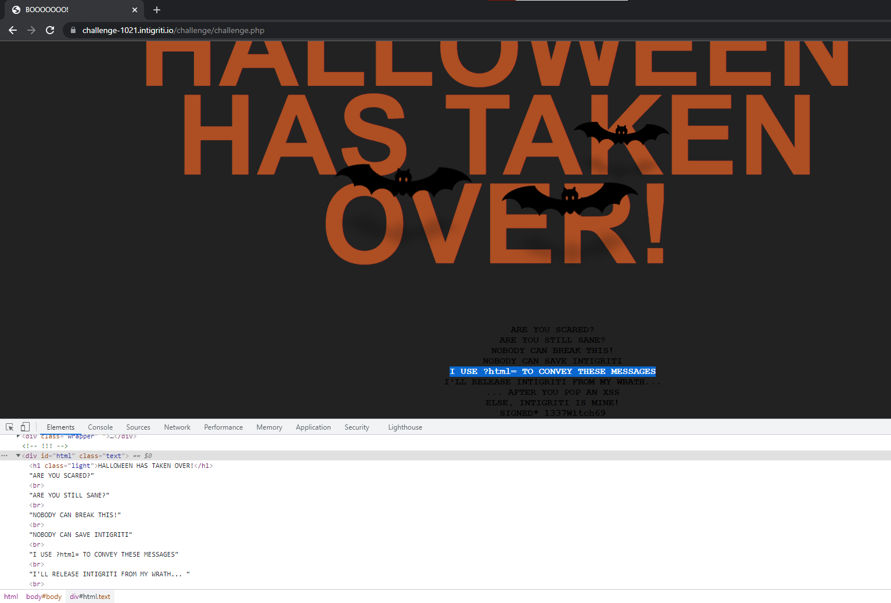

Trying to specify a custom text for the `html` parameter and testing for HTML injection (let's inject `<a href="#">`):

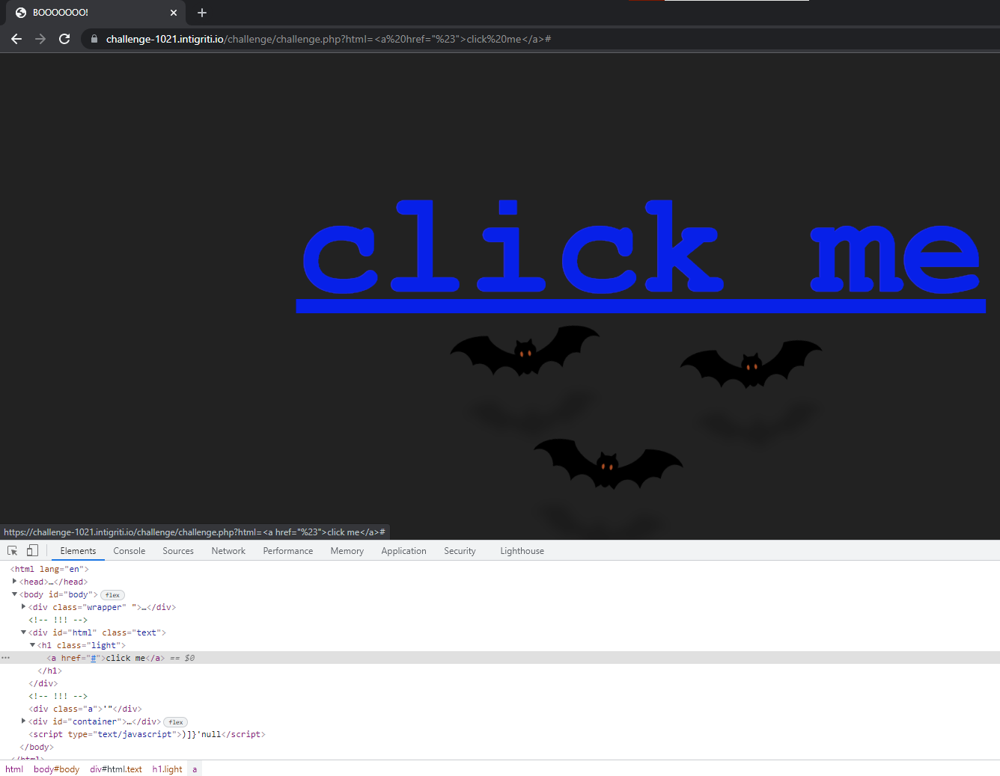

Observe that the additional text that were originally below are gone. Furthermore, notice that the injected `<a>` tag appears nested within a `<h1>` tag.

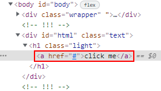

Because this challenge has CSP:

```html
<meta http-equiv="Content-Security-Policy" content="default-src 'none'; script-src 'unsafe-eval' 'strict-dynamic' 'nonce-1b5da4bc13f845058faff87ef9e13ccc'; style-src 'nonce-8db3c84b276004e62513b91128fb3794'">
```

We are unable to inject arbitrary `<script>` or trigger any event handling functions (such as `onerror=alert()`) as it requires a valid *nonce*.

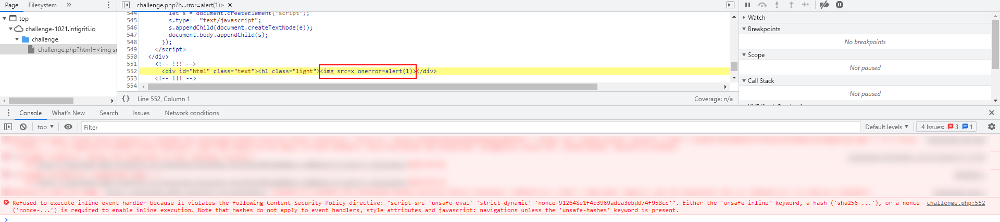

Time to look at the JS source on the page then.

---

The only code that stood out in the page was the following:

```html
<script nonce="1b5da4bc13f845058faff87ef9e13ccc">
    window.addEventListener("DOMContentLoaded", function () {
        e = `)]}'` + new URL(location.href).searchParams.get("xss");
        c = document.getElementById("body").lastElementChild;
        if (c.id === "intigriti") {
            l = c.lastElementChild;
            i = l.innerHTML.trim();
            f = i.substr(i.length - 4);
            e = f + e;
        }
        let s = document.createElement("script");
        s.type = "text/javascript";
        s.appendChild(document.createTextNode(e));
        document.body.appendChild(s);
    });
</script>
```

It appears that this script triggers a function once all DOM content has loaded. We see that the variable `e` is set to `)]}'` concatenated with any value that we specify in the `xss` HTTP parameter. Then, the variable `c` is set to the last HTML element within the `<body>` tag. By default, this sets it to the `<div>` container (the one with the neon `INTIGRITI` letters).

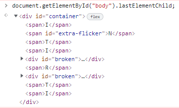

We see that the "id" of `c` is checked to see if it equals to "intigriti" before it executes a few more lines of code. Since the "id" of `c` is currently "container", the condition will not be met. Finally, `s` is set as a `<script>` tag which will append the contents of `e` as a child within itself.

Setting the HTTP parameter `xss` to be `-alert(1)` since we are inside a `<script>` tag:

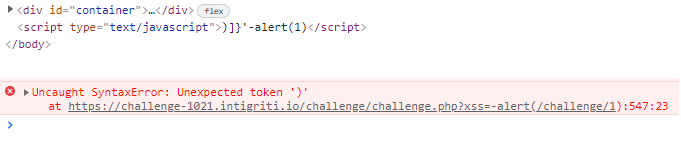

Fails since the there are the random `)]}'` characters at the start of the line.

Looking at the `if` block in the code:

```js
c = document.getElementById("body").lastElementChild;
if (c.id === "intigriti") {
    l = c.lastElementChild;
    i = l.innerHTML.trim();
    f = i.substr(i.length - 4);
    e = f + e;
}
```

If we can find a way to enter the loop, the code will take the last 4 characters of the last child in `c` and **prepend** it to `e`. This means that we can close the meddlesome single quote.

It is time to combine our findings.

---

Back to the `html` HTTP parameter, it appears that we are able to inject a closing `</div>` tag in order to escape from the current `<div>` container.

`?html=</div>hello` results in:

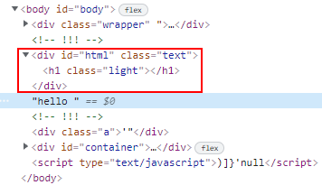

> The `</h1>` tag is automatically inserted by the browser to conform to a valid HTML structure.

What happens if we insert additional HTML elements after closing?

`?html=</div><a>hello` results in:

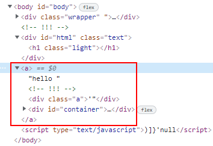

Notice that the `<div id="container">` is now a child of the injected `<a>` tag.

> Once again, this is due to the browser mutating the HTML elements to ensure that it conforms to the standard. Since `<a>` is opened and `</a>` is not found, when the browser detects new opening tags `<div>`, it will be considered as a child of `<a>`.

We have now successfully controlled the last element within the `<body>` tag. Time to satisfy the `if` condition clause by setting `id=intigriti`. Set the payload to `?html=</div><a id=intigriti>hello`, a breakpoint in the source within the `if` block and confirm that execution reaches within it:

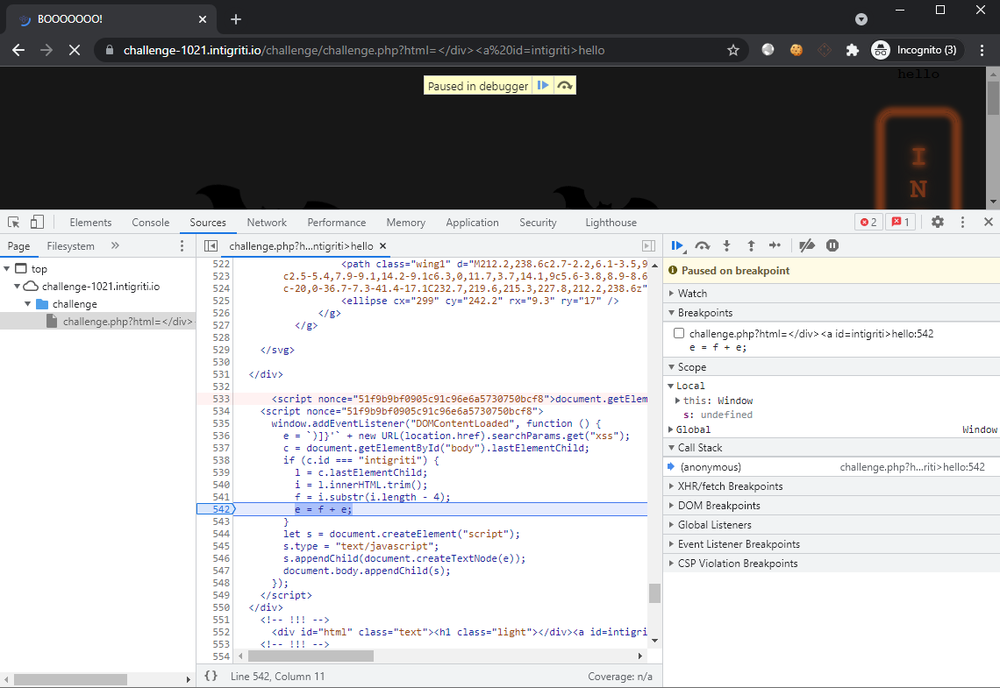

We can now control the variables `l` `i` `f` `e` to ensure that the `)]}'` can be negated. To do so, we just have to insert **two nested** child elements in which the inner-most child has its **4th last character** as a single-quote `'`. This results in the output becoming: `')]}'`.

> Did you know: single-quotes can be part of a HTML tag name?

Let's try the payload: `?html=</div><a id=intigriti><b><c'de>hello`

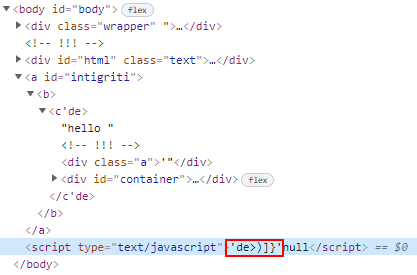

> The mutation done by the browser will automatically close the child tags, which means that the inner-most tag `<c'de>` will be closed with `</c'de>` and the **4th last character** is `'`.

We have managed to close the single quote. It is time to insert the `xss` HTTP parameter back and tidy up the current `html` parameter payload. The final payload will thus be:

```http
?html=</div><a><b><c'de>&xss=-alert(document.domain)
```

Or check it out [here](https://challenge-1021.intigriti.io/challenge/challenge.php?html=%3C/div%3E%3Ca+id=intigriti%3E%3Cb%3E%3Cc%27de%3E&xss=-alert(document.domain))

Finally, the XSS is triggered at long last:

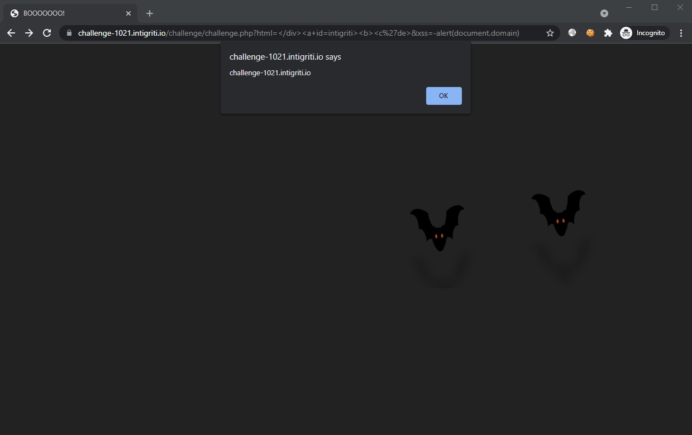
